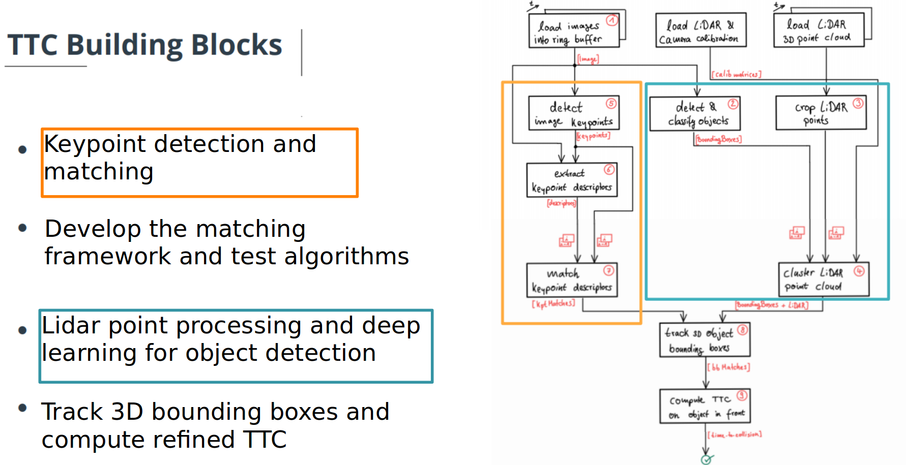

# 3D Object Tracking

Program schematic.

Major blocks: 
1. Match 3D objects over time by using keypoint correspondences. 
2. Compute the TTC based on Lidar measurements. 
3. Compute the TTC based on camera output, requires to first associate keypoint matches to regions of interest and then to compute the TTC based on those matches. 
4. Lastly, tests with the framework. Identify the most suitable detector/descriptor combination for TTC estimation and also to search for problems that can lead to faulty measurements by the camera or Lidar sensor. 

*TTC: Time to collision

## Dependencies for Running Locally
* cmake >= 2.8
* make >= 4.1 (Linux, Mac), 3.81 (Windows)
* OpenCV >= 4.1
  * This must be compiled from source using the `-D OPENCV_ENABLE_NONFREE=ON` cmake flag for testing the SIFT and SURF detectors.
  * The OpenCV 4.1.0 source code can be found [here](https://github.com/opencv/opencv/tree/4.1.0)
* gcc/g++ >= 5.4

## Basic Build Instructions

1. Clone this repo.
2. Make a build directory in the top level project directory: `mkdir build && cd build`
3. Compile: `cmake .. && make`
4. Run it: 

Usage: 

      ./3D_object_tracking <Detector type> <Descriptor type> <Matcher type> <Match selector type>
      
Detector types: SHITOMASI , HARRIS , FAST , BRISK , ORB, AKAZE , SIFT

Descriptor types: BRISK , BRIEF , ORB , FREAK , AKAZE , SIFT

Matcher types: MAT_BF, MAT_FLANN

Selector types: SEL_NN , SEL_KNN

Note: you can only use AKAZE detector with AKAZE descriptor, so don't mix AKAZE det/desc with oher options

## Performance Evaluation

Please see file report_perf_cam_TTC/report_object_3D_tracking.pdf or cam_TTC/report_object_3D_tracking.xlsx

  
